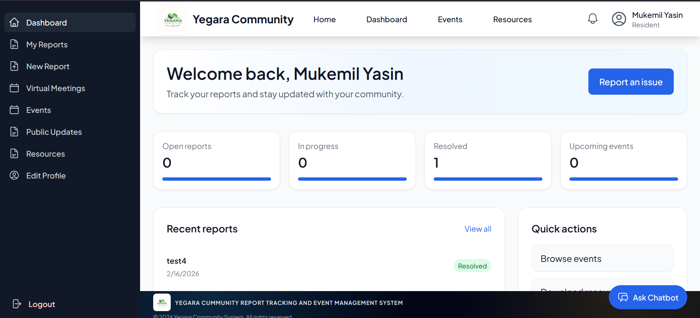
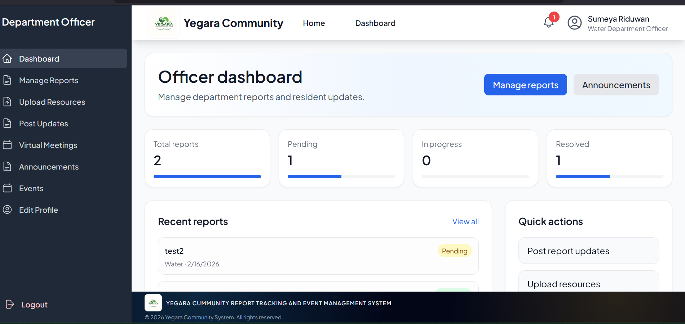
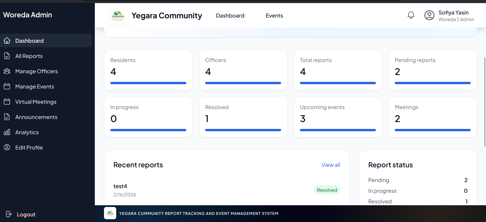
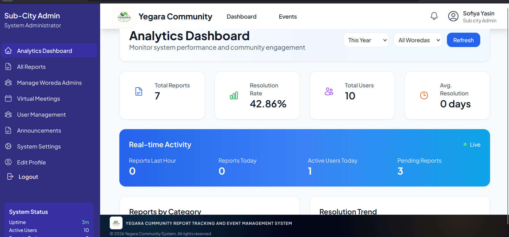
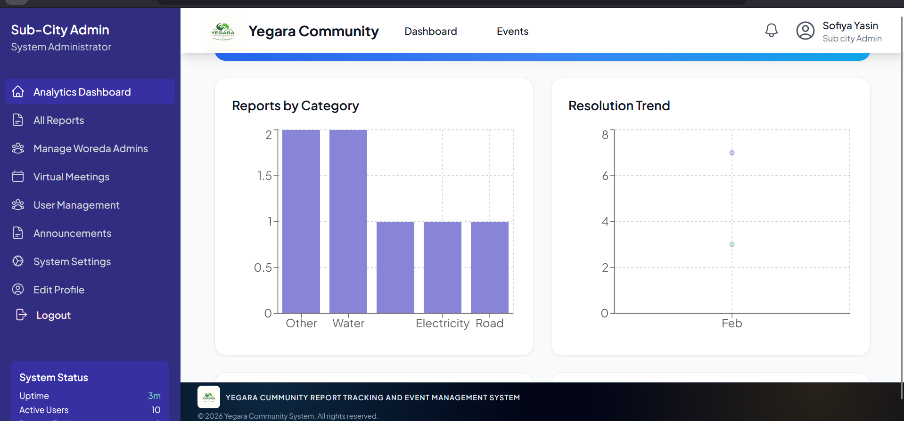
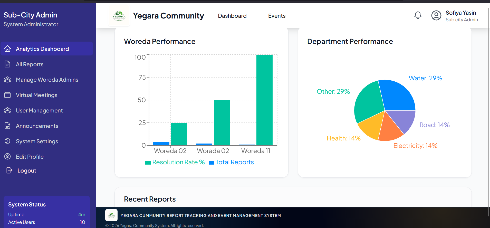

# Yegara Community Reporting and Event Management System

Yegara is a full-stack community platform that helps residents report local issues, track service progress, and stay informed through announcements, events, meetings, and notifications.

This repository contains:
- A Node.js + Express + MongoDB backend API
- A React frontend dashboard for residents and administrators

## Table of Contents

- [Project Overview](#project-overview)
- [Core Features](#core-features)
- [Screenshots](#screenshots)
- [Tech Stack](#tech-stack)
- [Project Structure](#project-structure)
- [Getting Started](#getting-started)
- [Environment Variables](#environment-variables)
- [Running the Application](#running-the-application)
- [API Overview](#api-overview)
- [Available Scripts](#available-scripts)
- [Security and Operational Notes](#security-and-operational-notes)
- [Future Improvements](#future-improvements)
- [License](#license)

## Project Overview

The system is designed for local community governance workflows:
- Residents submit and monitor issue reports.
- Officers and administrators manage reports and coordinate responses.
- Community updates are broadcast through announcements and notifications.
- Events and meetings are published to improve public participation.
- A chatbot endpoint provides resident/public guidance.

## Core Features

- Role-based authentication and authorization
- Report lifecycle management (submission, updates, status tracking)
- Event and meeting management
- Announcement publishing
- Resource/document sharing
- Real-time notifications with Socket.IO
- Public endpoints for landing data and chatbot support
- Email-based account activation and password reset

## Screenshots

The following image assets are stored in `frontend/public` and can be used in the app or displayed here for quick reference.

| Resident Dashboard | Officer Dashboard | Woreda Dashboard |
|---|---|---|
|  |  |  |

| Sub City Dashboard | Sub City Dashboard 2 | Sub City Dashboard 3 |
|---|---|---|
|  |  |  |

| Yegara Logo | Addis Ababa | App Icon 192 |
|---|---|---|
|  |  |  |

| App Icon 512 | Favicon | |
|---|---|---|
|  |  | |

## Tech Stack

### Backend
- Node.js
- Express
- MongoDB + Mongoose
- Socket.IO
- JWT authentication
- Nodemailer
- LangChain + OpenAI integration (optional chatbot enhancement)

### Frontend
- React
- React Router
- Axios
- Tailwind CSS
- React Hook Form
- Recharts
- Socket.IO client

## Project Structure

```text
yegara-community-system/
|- backend/
|  |- controllers/
|  |- middleware/
|  |- models/
|  |- routes/
|  |- services/
|  |- utils/
|  |- server.js
|  \- package.json
|- frontend/
|  |- src/
|  |  |- components/
|  |  |- context/
|  |  |- pages/
|  |  \- services/
|  \- package.json
\- README.md
```

## Getting Started

### Prerequisites

- Node.js 18+ (recommended)
- npm 9+
- MongoDB instance (local or cloud)

### 1. Clone and enter the repository

```bash
git clone <your-repository-url>
cd yegara-community-system
```

### 2. Install dependencies

```bash
cd backend && npm install
cd ../frontend && npm install
```

## Environment Variables

Create a `.env` file inside `backend/` and configure values like the following:

```env
NODE_ENV=development
PORT=5000

MONGODB_URI=mongodb://127.0.0.1:27017/yegara

JWT_SECRET=replace_with_secure_secret
JWT_EXPIRE=30d
JWT_COOKIE_EXPIRE=30

FRONTEND_URL=http://localhost:3000

SMTP_HOST=smtp.example.com
SMTP_PORT=587
SMTP_USER=your_smtp_username
SMTP_PASS=your_smtp_password
FROM_NAME=Yegara System
FROM_EMAIL=no-reply@example.com

# Optional: chatbot LLM integration
OPENAI_API_KEY=your_openai_api_key
OPENAI_MODEL=gpt-4o-mini
```

Create a `.env` file inside `frontend/`:

```env
REACT_APP_API_URL=http://localhost:5000/api
```

## Running the Application

Use two terminals.

### Start backend

```bash
cd backend
npm run dev
```

Backend default URL: `http://localhost:5000`

### Start frontend

```bash
cd frontend
npm start
```

Frontend default URL: `http://localhost:3000`

## API Overview

Base API path: `/api`

Main route groups:
- `/api/auth`
- `/api/reports`
- `/api/users`
- `/api/analytics`
- `/api/events`
- `/api/resources`
- `/api/meetings`
- `/api/announcements`
- `/api/notifications`
- `/api/public`
- `/api/chatbot`

Health check:
- `GET /api/health`

## Available Scripts

### Backend (`backend/package.json`)
- `npm start` - Run with Node.js
- `npm run dev` - Run with nodemon

### Frontend (`frontend/package.json`)
- `npm start` - Development server
- `npm run build` - Production build
- `npm test` - Run tests

## Security and Operational Notes

- CORS is configured to allow the frontend URL defined by `FRONTEND_URL`.
- Basic rate limiting is enabled on `/api`.
- Helmet is enabled for security headers.
- Uploaded files are served from `/uploads`.
- The `mongodb-data/` folder appears to contain local database files; avoid committing real data in public repositories.

## Future Improvements

- Add API documentation (OpenAPI/Swagger)
- Add end-to-end tests and CI workflows
- Add Docker setup for one-command local run
- Add seed scripts for demo data

## License

This project is currently licensed under the MIT License (as declared in backend package settings).

